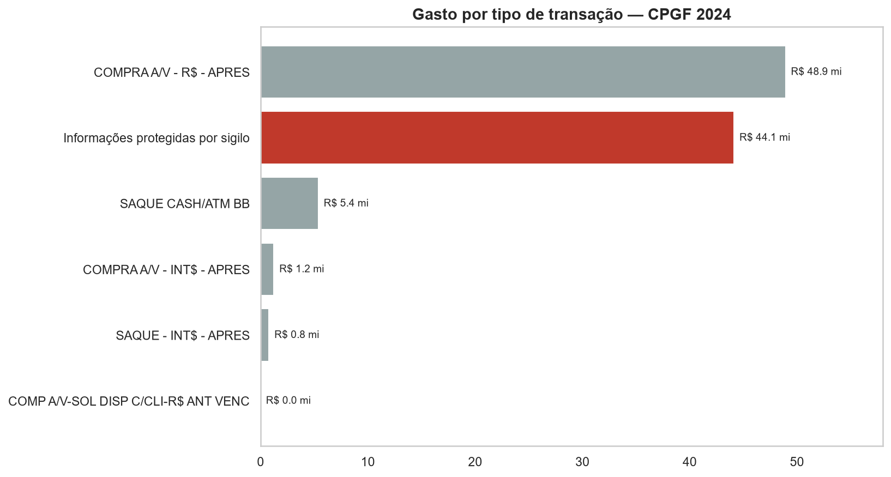
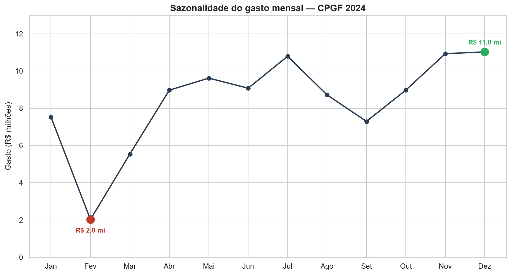
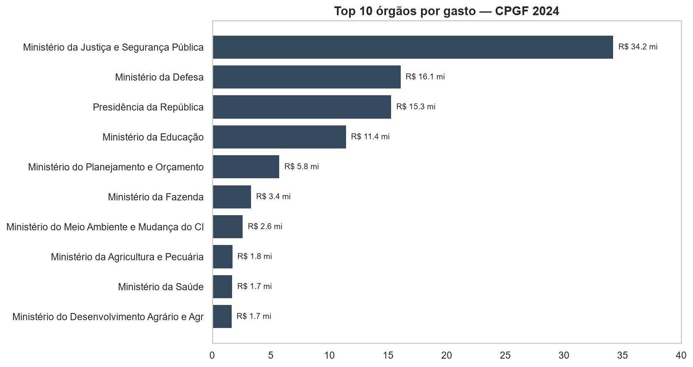

# Análise CPGF 2024 — Gastos com Cartões Corporativos do Governo Federal

Realizei uma análise exploratória trabalhando com dados abertos do **Cartão de Pagamento do Governo Federal (CPGF)** referentes a 2024 — 141 mil transações do Portal da Transparência. O objetivo: medir o quão transparente é esse gasto público. A descoberta central: **43,9% do valor é classificado como sigiloso.**

---

## Contexto: o que é o CPGF?

O **Cartão de Pagamento do Governo Federal (CPGF)** é um cartão corporativo usado por órgãos públicos federais para despesas de pequeno vulto — compras presenciais, serviços e, em alguns casos, saques. A ideia é dar agilidade a gastos do dia a dia da administração pública, sem precisar de um processo de licitação para cada pequena despesa.

Por lei, todas essas transações são publicadas no **Portal da Transparência**. Isso torna o CPGF um campo fértil para análise de dados abertos: dá para acompanhar, transação a transação, como o dinheiro público é gasto. Este projeto pega os dados de 2024 e responde três perguntas:

1. **Quão transparente é esse gasto?** Quanto do valor é divulgado e quanto é sigiloso?
2. **Como o gasto se comporta ao longo do ano?** Existe sazonalidade? Qual a causa?
3. **Quem gasta?** O uso é distribuído pela máquina pública ou concentrado em poucos órgãos?

---

## Objetivo do projeto

Mais do que descrever os números, o projeto busca **investigar** o que eles significam para o controle do dinheiro público. A pergunta que guia tudo é a da **transparência**: o cartão corporativo é uma ferramenta de gasto aberto e fiscalizável, ou existe uma lacuna entre o que é divulgado e o que de fato acontece?

Como projeto de portfólio, ele também demonstra um fluxo de trabalho completo de análise de dados: da coleta do dado bruto até a conclusão, passando por limpeza, modelagem e visualização — com uma separação clara entre a etapa de preparação dos dados (ETL) e a etapa de análise.

---

## Metodologia

O projeto segue um pipeline reprodutível, com cada etapa em seu lugar:

1. **Coleta** — download dos 12 extratos mensais (CSV) da seção CPGF do Portal da Transparência.
2. **ETL (limpeza e padronização)** — um script (`src/etl.py`) lê os 12 CSVs, trata os problemas do dado bruto e consolida tudo em um único banco SQLite. Os tratamentos incluem:
   - correção de **encoding** (`windows-1252`, padrão dos arquivos do governo);
   - conversão de valores do formato brasileiro (`1.234,56`) para número;
   - padronização dos nomes das colunas;
   - uma checagem de integridade que garante que nenhuma linha se perde na limpeza.
3. **Armazenamento** — o dado limpo é salvo em um banco **SQLite** (`data/cpgf_2024.db`), separando a preparação da análise.
4. **Análise** — o notebook lê o dado já tratado e conduz as três investigações, cada uma com cálculo, gráfico e conclusão.
5. **Visualização** — gráficos em matplotlib/seaborn, exportados para `outputs/figures/`.

Um ponto de método importante: na análise de sazonalidade, em vez de aceitar a explicação intuitiva para a variação mensal, a hipótese foi **testada** e refutada com os dados (detalhe abaixo).

---

## Principais descobertas

### 1. Quase metade do gasto é sigiloso

Dos R$ 100,5 milhões movimentados no cartão em 2024, **R$ 44,1 milhões (43,9%)** foram em transações cujo tipo é protegido por sigilo — ou seja, não se sabe publicamente em quê o dinheiro foi gasto. É a **segunda maior categoria** de gasto, atrás apenas das compras presenciais.

Mais do que volume, o que chama atenção é o **tamanho** dessas transações: embora representem cerca de 26% da quantidade de transações, concentram 43,9% do valor. Na prática, o ticket médio de uma transação sigilosa é **mais que o dobro** do de uma compra comum.



### 2. O gasto segue o ciclo do orçamento, não a necessidade

O valor gasto varia muito ao longo do ano: de **R$ 2,0 mi em fevereiro** (o vale) a **R$ 11,0 mi em dezembro** (o pico) — uma diferença de mais de 5x.

A explicação intuitiva seria "fevereiro gasta menos porque tem menos dias úteis". **Testei essa hipótese**: dividi o gasto de cada mês pelo seu número de dias úteis, para colocar todos na mesma régua. O resultado refuta a explicação — mesmo corrigido por dia útil, fevereiro continua na base, muito abaixo dos meses fortes. A diferença de dias úteis não dá conta de uma variação tão grande.

O padrão real (gasto contido no início do ano, disparando no fim) é a assinatura do **ciclo orçamentário público**: no fim do ano, os órgãos correm para executar o que sobrou do orçamento antes do fechamento do exercício; no começo, o orçamento novo ainda está se organizando.



### 3. Dez órgãos concentram 93,6% do gasto

O uso do cartão não é distribuído pela máquina pública — é **dominado por poucos órgãos**. Os 10 maiores respondem por **93,6%** de todo o gasto, e o restante de toda a administração federal fica com menos de 7%.

O **Ministério da Justiça e Segurança Pública** lidera isoladamente, com R$ 34,2 mi — sozinho, cerca de 34% do total, e mais que o dobro do segundo colocado. A concentração faz sentido pelo perfil dos órgãos: Justiça e Defesa têm grande operação de campo, que naturalmente demanda mais uso de cartão.



---

## Conclusão

Juntas, as três descobertas mostram um cartão corporativo **concentrado e opaco**: poucos órgãos respondem por quase todo o gasto, o uso dispara no fim do ano seguindo o ciclo do orçamento, e quase metade do dinheiro passa por transações sigilosas de alto valor — fora do alcance de quem quer fiscalizar. E a maior parte desse sigilo está justamente onde os valores são maiores: na Justiça e na Segurança.

**O que vale investigar a seguir:**

- **O pico de dezembro** — verificar se o salto para R$ 11,0 milhões reflete demanda real ou "queima de orçamento" (gastar o saldo restante antes do fechamento do exercício).
- **O gasto sigiloso do Top 10** — pedidos via Lei de Acesso à Informação (LAI) sobre as justificativas legais do sigilo ajudariam a entender o que são esses R$ 44,1 milhões e se o ticket médio elevado é condizente com operações de segurança.

---

## Stack

| Camada | Ferramenta |
|---|---|
| Limpeza / ETL | Python · pandas |
| Armazenamento | SQLite |
| Análise | pandas · numpy |
| Visualização | matplotlib · seaborn |
| Notebook | Jupyter |

---

## Como rodar

```bash
# 1. Clonar o repositório
git clone https://github.com/Lucasfontez/cpgf-2024-analise.git
cd cpgf-2024-analise

# 2. Criar e ativar o ambiente virtual
python -m venv venv
venv\Scripts\activate          # Windows
# source venv/bin/activate     # Linux / macOS

# 3. Instalar as dependências
pip install -r requirements.txt

# 4. Colocar os 12 CSVs do Portal em data/raw/ e rodar o ETL
python -m src.etl              # gera data/cpgf_2024.db

# 5. Abrir o notebook
jupyter notebook notebooks/analise_cpgf.ipynb
```

> Todos os comandos rodam a partir da raiz do projeto.

---

## Estrutura do projeto

```
cpgf-2024-analise/
├── data/
│   ├── raw/                  # 12 CSVs mensais do Portal (não versionados)
│   └── cpgf_2024.db          # banco SQLite gerado pelo ETL
├── src/
│   ├── config.py             # caminhos (pathlib) e constantes
│   └── etl.py                # CSV → limpeza → SQLite
├── notebooks/
│   └── analise_cpgf.ipynb    # a análise completa (cálculo + gráficos + conclusões)
├── outputs/figures/          # gráficos exportados em PNG
├── docs/
│   └── data_dictionary.md    # dicionário das 15 colunas
├── tests/
│   └── test_etl.py           # teste do ETL
├── requirements.txt
└── README.md
```

---

## Sobre os dados

- **Fonte:** [Portal da Transparência — Governo Federal](https://portaldatransparencia.gov.br/)
- **Período:** janeiro a dezembro de 2024
- **Volume:** 141.048 transações · 15 colunas
- **Dicionário de dados:** [`docs/data_dictionary.md`](docs/data_dictionary.md)

O dado bruto (12 CSVs mensais) é limpo pela etapa de ETL (`src/etl.py`) e consolidado em um banco SQLite. O notebook lê o dado já tratado.

---

## Autor

**Lucas Fontes**

[LinkedIn](https://www.linkedin.com/in/lucassfontesc/) · fonteslucas678@gmail.com

<sub>Projeto de portfólio em Análise de Dados.</sub>